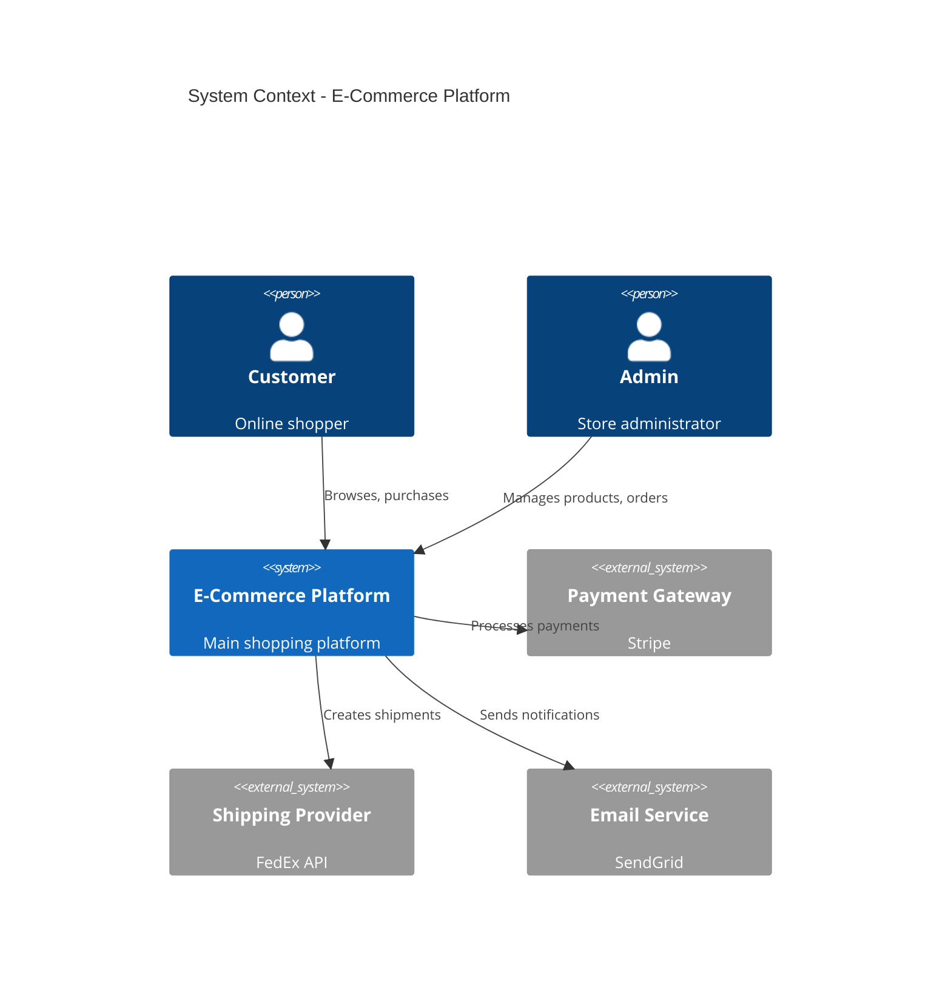

# C4 Diagram Patterns

## System Context (Mermaid - Experimental)



---

## Container Diagram (PlantUML Recommended)

```text
@startuml
!include https://raw.githubusercontent.com/plantuml-stdlib/C4-PlantUML/master/C4_Container.puml

title Container Diagram - E-Commerce Platform

Person(customer, "Customer", "Online shopper")

System_Boundary(platform, "E-Commerce Platform") {
    Container(web, "Web Application", "React", "Customer-facing storefront")
    Container(admin, "Admin Panel", "React", "Back-office management")
    Container(api, "API Gateway", "Node.js", "API routing and auth")
    Container(catalog, "Catalog Service", "Go", "Product management")
    Container(orders, "Order Service", "Go", "Order processing")
    Container(cart, "Cart Service", "Go", "Shopping cart")
    ContainerDb(db, "Database", "PostgreSQL", "Persistent storage")
    Container(cache, "Cache", "Redis", "Session and product cache")
    Container(queue, "Message Queue", "RabbitMQ", "Async processing")
}

Rel(customer, web, "Uses", "HTTPS")
Rel(web, api, "API calls", "REST")
Rel(admin, api, "API calls", "REST")
Rel(api, catalog, "Routes to")
Rel(api, orders, "Routes to")
Rel(api, cart, "Routes to")
Rel(catalog, db, "Reads/Writes")
Rel(orders, db, "Reads/Writes")
Rel(cart, cache, "Reads/Writes")
Rel(orders, queue, "Publishes")
@enduml
```

---

## C4 Level Selection Guide

| Level | Shows | Use When |
| --- | --- | --- |
| Context | Systems + external actors | Stakeholder overview, scope definition |
| Container | Deployable units | Developer onboarding, tech decisions |
| Component | Code modules | Detailed design, refactoring planning |
| Code | Classes/functions | Rarely needed, usually redundant |

---

## C4 Tool Recommendation

| Scenario | Recommended Tool |
| --- | --- |
| Quick context diagram | Mermaid (experimental but works) |
| Complex multi-container | PlantUML (mature, better layout) |
| Enterprise with icons | PlantUML (sprite support) |
| GitHub rendering needed | Mermaid (native support) |
