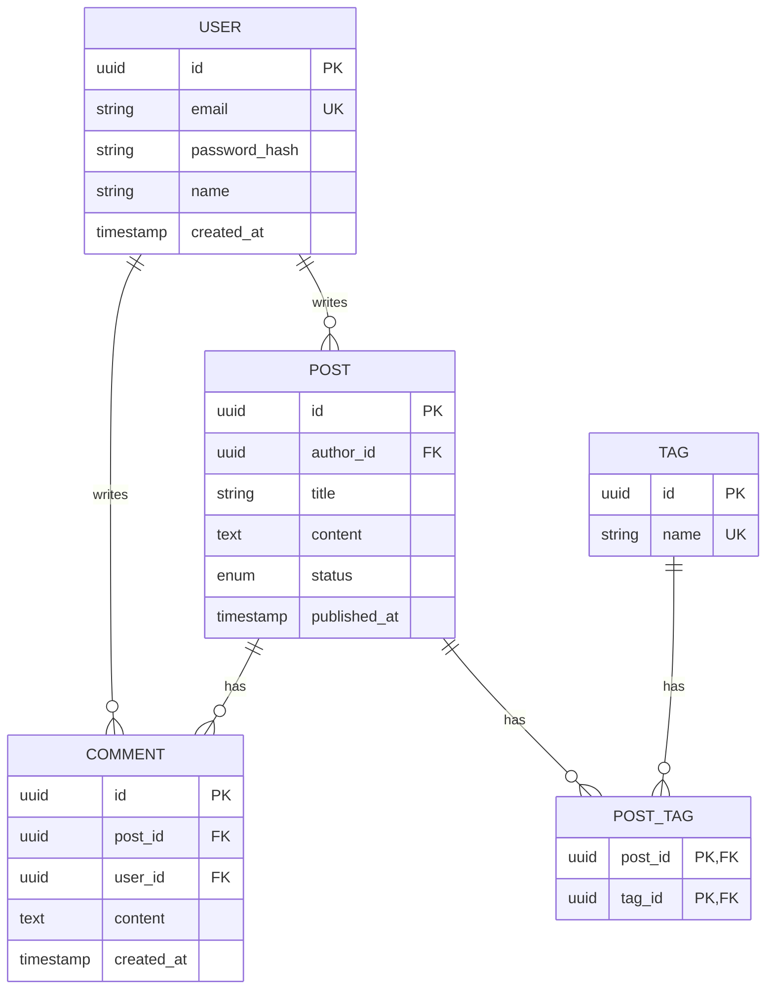
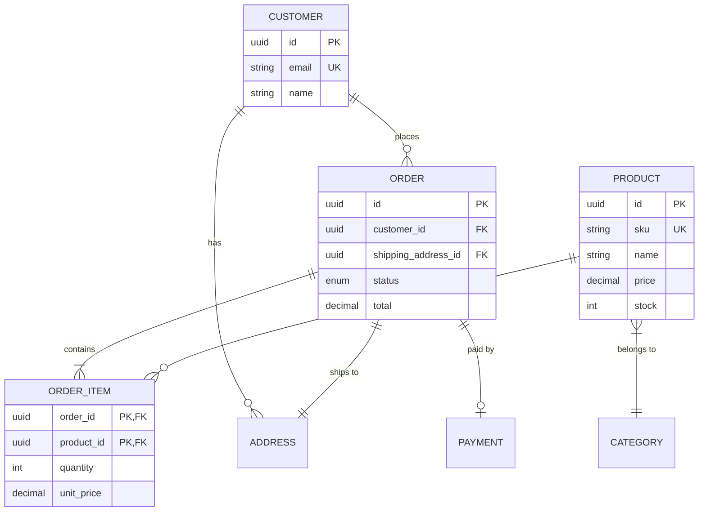
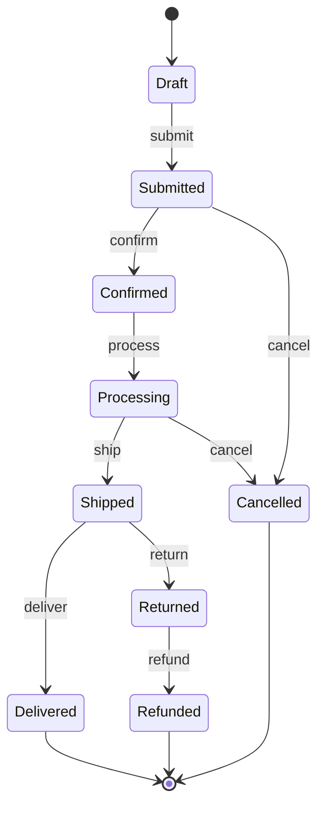
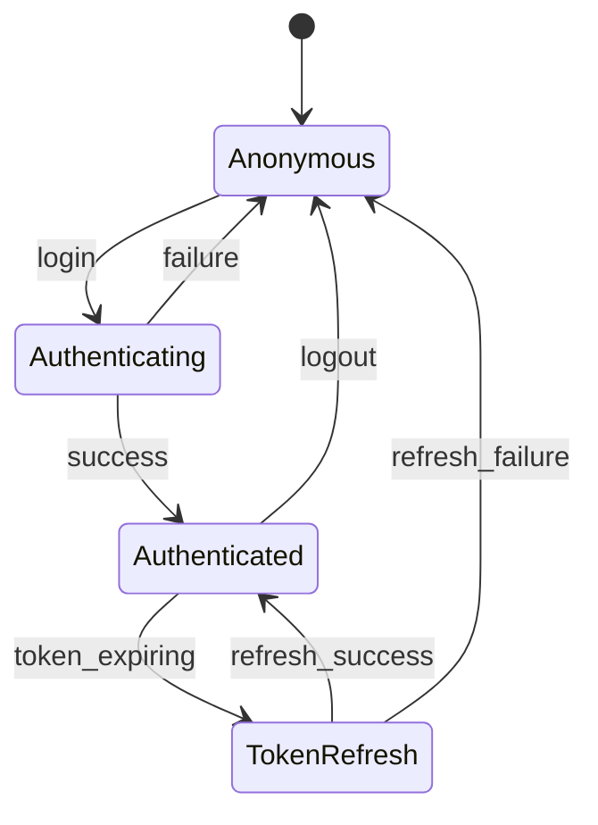
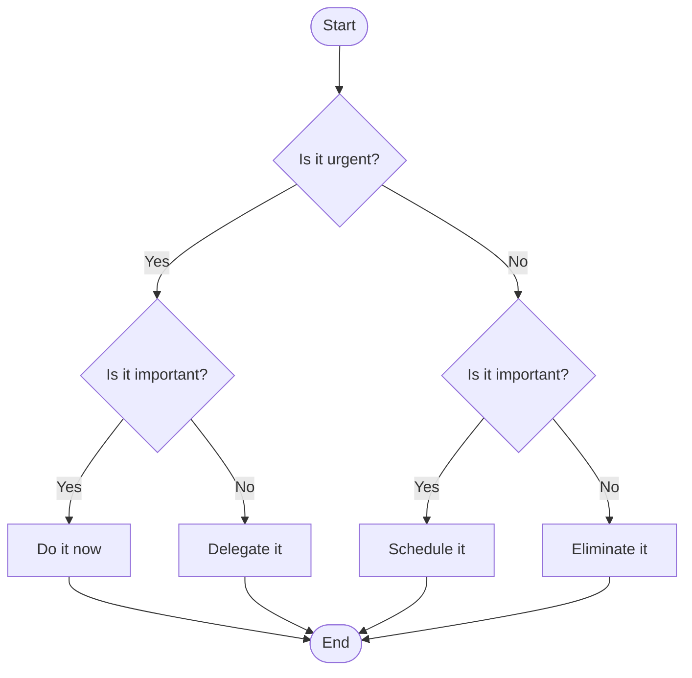
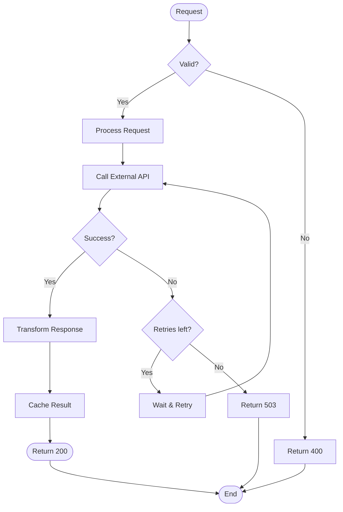

# ER, State & Flowchart Patterns

## ER Diagram Patterns

### Blog Schema

### E-Commerce Schema

---

## State Diagram Patterns

### Order Lifecycle

### Authentication State

---

## Flowchart Patterns

### Decision Tree

### Error Handling Flow

