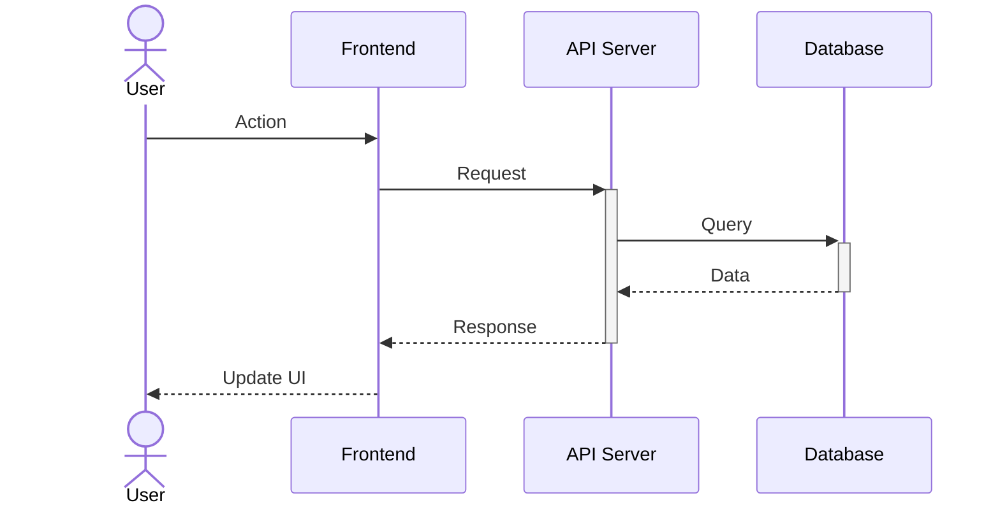
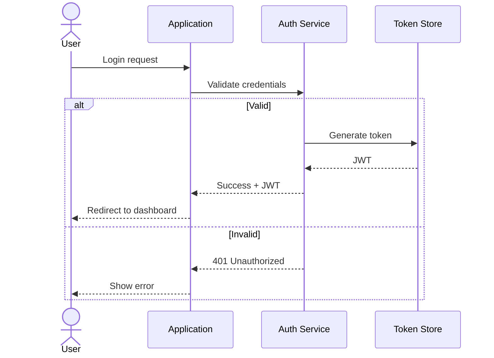
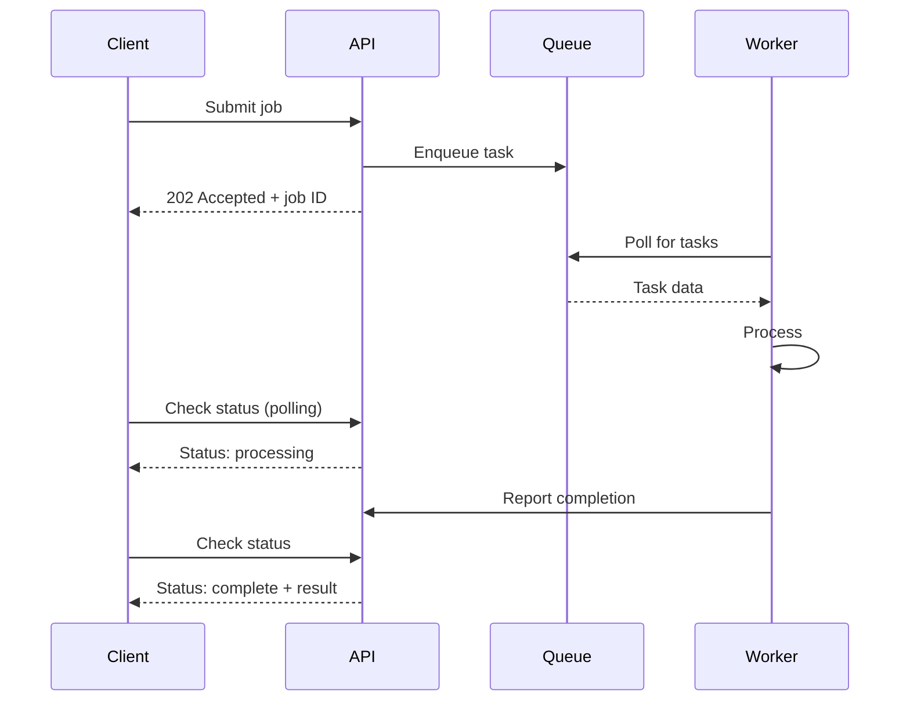
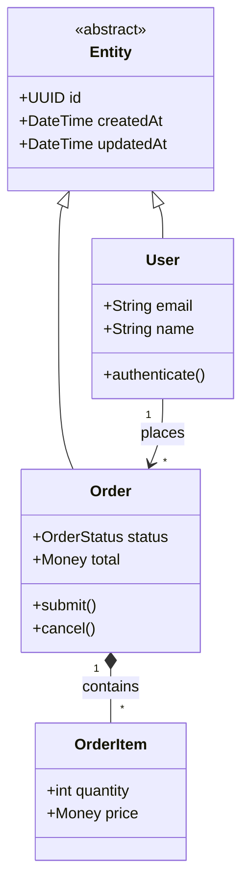
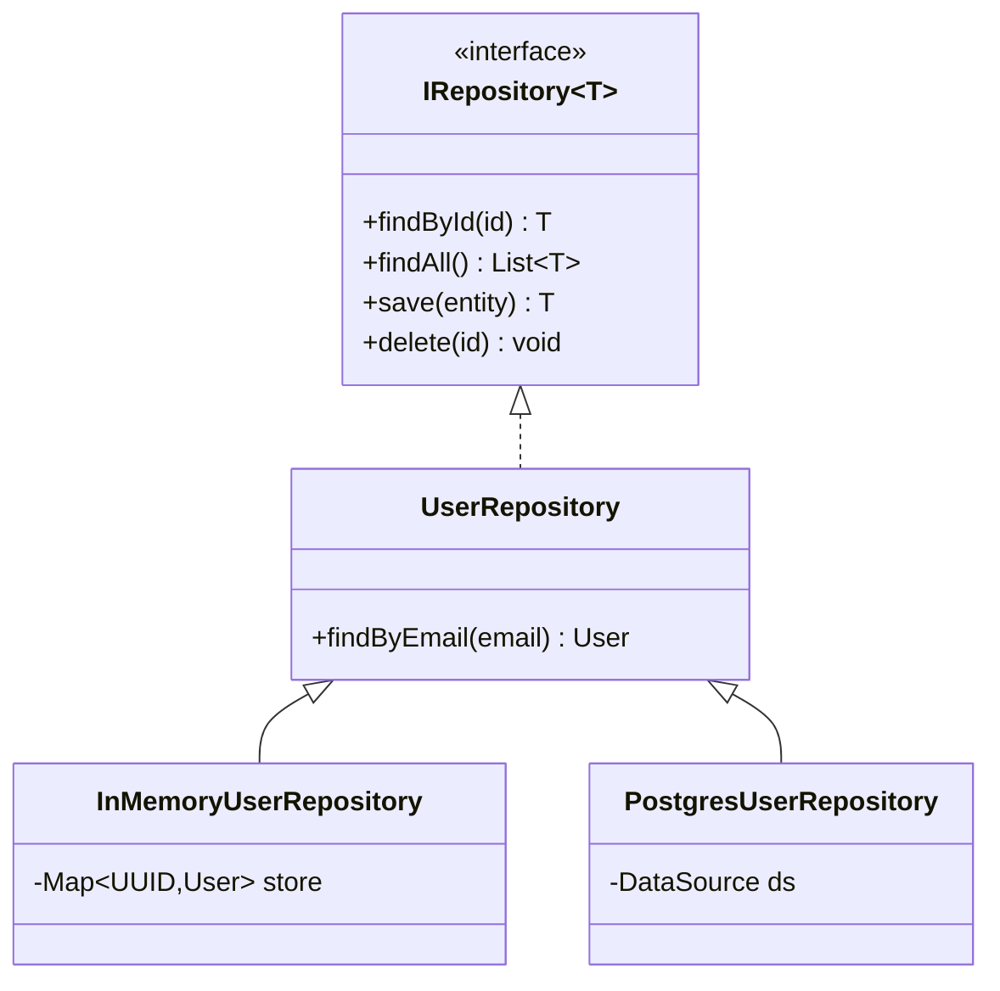
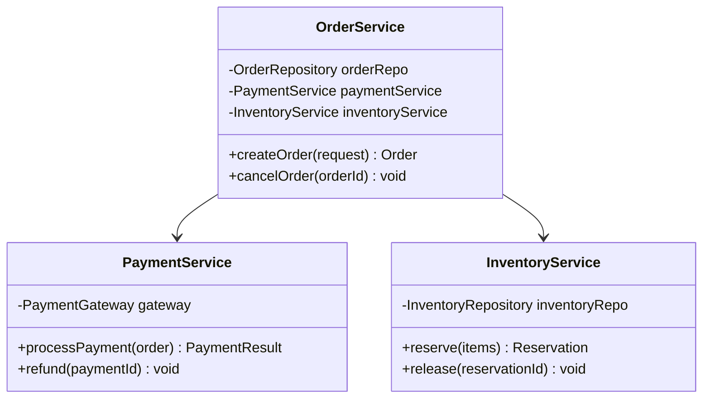

# Sequence & Class Diagram Patterns

## Sequence Diagram Patterns

### API Request/Response

### Authentication Flow

### Async Processing

---

## Class Diagram Patterns

### Domain Model

### Repository Pattern

### Service Layer

