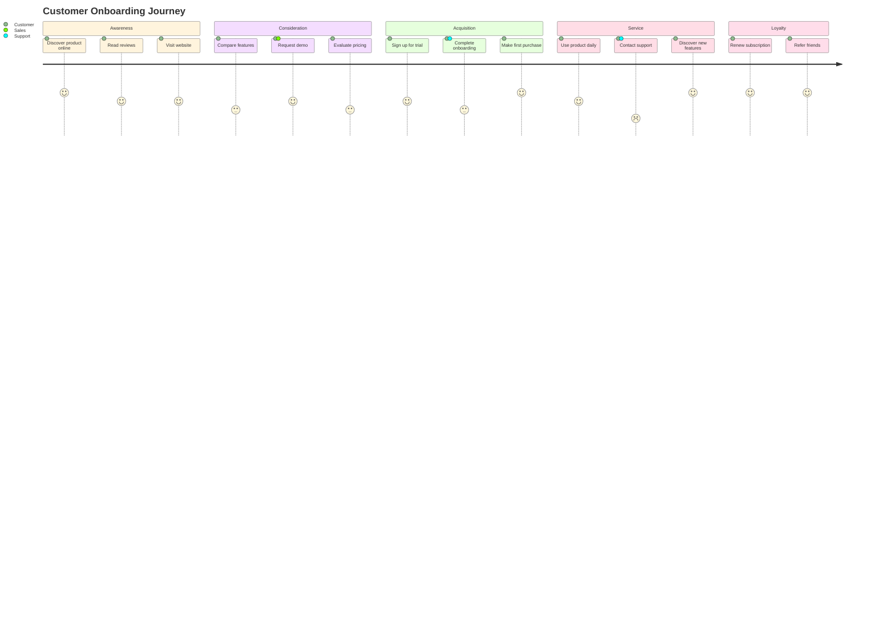

# Journey Map Command

Create customer journey maps from elicited requirements, visualizing the complete user experience.

## Usage

```bash
/requirements-elicitation:journey-map
/requirements-elicitation:journey-map --domain "onboarding"
/requirements-elicitation:journey-map --domain "checkout" --persona "first-time-buyer"
/requirements-elicitation:journey-map --domain "support" --format mermaid
```

## Arguments

| Argument | Required | Description |
|----------|----------|-------------|
| --domain | No | Domain to map (default: current/most recent) |
| --persona | No | Specific persona to map (default: primary user) |
| --format | No | Output format: `mermaid`, `yaml`, `markdown` (default: `mermaid`) |

## Workflow

### Step 1: Load Synthesized Requirements

Read from `.requirements/{domain}/synthesis/` and `.requirements/{domain}/interview/` folders.

### Step 2: Identify Journey Stages

Map the end-to-end experience from first awareness to post-completion:

```yaml
journey_stages:
  awareness:
    description: "User becomes aware of need/problem"
    questions:
      - "What triggers the user to start?"
      - "How do they discover the solution?"

  consideration:
    description: "User evaluates options"
    questions:
      - "What alternatives do they consider?"
      - "What information do they need?"

  acquisition:
    description: "User obtains the solution"
    questions:
      - "How do they sign up/purchase?"
      - "What's the onboarding experience?"

  service:
    description: "User uses the solution"
    questions:
      - "What's the day-to-day experience?"
      - "What tasks do they perform?"

  loyalty:
    description: "User becomes repeat customer"
    questions:
      - "What brings them back?"
      - "Would they recommend to others?"
```

### Step 3: Map Touchpoints

Identify all interaction points in each stage:

```yaml
touchpoint_types:
  digital:
    - Website
    - Mobile app
    - Email
    - SMS

  human:
    - Customer service
    - Sales
    - Support chat

  physical:
    - Store
    - Package
    - Documentation
```

### Step 4: Capture Emotional Journey

Document user emotions at each stage:

```yaml
emotional_journey:
  positive:
    - Excited
    - Confident
    - Satisfied
    - Delighted

  neutral:
    - Curious
    - Focused
    - Waiting

  negative:
    - Frustrated
    - Confused
    - Anxious
    - Disappointed
```

### Step 5: Identify Pain Points and Opportunities

Extract from requirements and interviews:

```yaml
analysis:
  pain_points:
    - Source: Interview transcript, stakeholder complaint
    - Location: Which stage/touchpoint
    - Severity: Critical, Major, Minor

  opportunities:
    - Gap in current experience
    - Unmet need from requirements
    - Potential delight moment
```

### Step 6: Generate Output

Create the journey map in the requested format.

## Output Formats

### Mermaid Diagram (Default)



### Alternative: Flowchart Style

```mermaid
flowchart LR
    subgraph Awareness["🔍 Awareness"]
        A1["Discover<br/>😊 Curious"]
        A2["Research<br/>🤔 Evaluating"]
    end

    subgraph Consideration["⚖️ Consideration"]
        C1["Compare<br/>😐 Uncertain"]
        C2["Demo<br/>😊 Interested"]
    end

    subgraph Acquisition["🛒 Acquisition"]
        Q1["Sign Up<br/>😊 Excited"]
        Q2["Onboard<br/>😤 Frustrated"]
        Q3["First Use<br/>😊 Satisfied"]
    end

    subgraph Service["⚙️ Service"]
        S1["Daily Use<br/>😊 Confident"]
        S2["Support<br/>😤 Frustrated"]
    end

    subgraph Loyalty["❤️ Loyalty"]
        L1["Renew<br/>😊 Loyal"]
        L2["Refer<br/>😍 Advocate"]
    end

    A1 --> A2 --> C1 --> C2 --> Q1 --> Q2 --> Q3 --> S1 --> S2 --> L1 --> L2

    style Q2 fill:#ffcdd2
    style S2 fill:#ffcdd2
```



### YAML Export

```yaml
journey_map:
  title: "Customer Onboarding Journey"
  domain: "onboarding"
  persona: "first-time-user"
  created: "2025-12-26"

  stages:
    - name: "Awareness"
      emoji: "🔍"
      touchpoints:
        - name: "Discover product online"
          channel: "Search / Social"
          emotion: "curious"
          score: 5
        - name: "Read reviews"
          channel: "Review sites"
          emotion: "evaluating"
          score: 4

    - name: "Consideration"
      emoji: "⚖️"
      touchpoints:
        - name: "Compare features"
          channel: "Website"
          emotion: "uncertain"
          score: 3
          pain_point: "Hard to find comparison information"
        - name: "Request demo"
          channel: "Sales call"
          emotion: "interested"
          score: 4

    - name: "Acquisition"
      emoji: "🛒"
      touchpoints:
        - name: "Sign up for trial"
          channel: "Website"
          emotion: "excited"
          score: 4
        - name: "Complete onboarding"
          channel: "App"
          emotion: "frustrated"
          score: 2
          pain_point: "Onboarding too complex, too many steps"
          opportunity: "Simplify to 3-step wizard"

    - name: "Service"
      emoji: "⚙️"
      touchpoints:
        - name: "Daily use"
          channel: "App"
          emotion: "confident"
          score: 4
        - name: "Contact support"
          channel: "Chat / Email"
          emotion: "frustrated"
          score: 2
          pain_point: "Long wait times, repeated explanations"

    - name: "Loyalty"
      emoji: "❤️"
      touchpoints:
        - name: "Renew subscription"
          channel: "Email / App"
          emotion: "loyal"
          score: 5
        - name: "Refer friends"
          channel: "Word of mouth"
          emotion: "advocate"
          score: 5
          opportunity: "Add referral rewards program"

  summary:
    overall_score: 3.8
    critical_pain_points:
      - "Onboarding complexity"
      - "Support wait times"
    key_opportunities:
      - "Simplify onboarding wizard"
      - "Add self-service support"
      - "Implement referral program"
```

### Markdown Export

```markdown
# Customer Journey Map: Onboarding

**Persona:** First-Time User
**Domain:** Onboarding
**Created:** 2025-12-26

## Journey Overview

| Stage | Touchpoint | Channel | Emotion | Score |
|-------|------------|---------|---------|-------|
| 🔍 Awareness | Discover online | Search | 😊 Curious | 5 |
| 🔍 Awareness | Read reviews | Review sites | 🤔 Evaluating | 4 |
| ⚖️ Consideration | Compare features | Website | 😐 Uncertain | 3 |
| ⚖️ Consideration | Request demo | Sales | 😊 Interested | 4 |
| 🛒 Acquisition | Sign up | Website | 😊 Excited | 4 |
| 🛒 Acquisition | Onboarding | App | 😤 **Frustrated** | 2 |
| ⚙️ Service | Daily use | App | 😊 Confident | 4 |
| ⚙️ Service | Contact support | Chat | 😤 **Frustrated** | 2 |
| ❤️ Loyalty | Renew | App | 😊 Loyal | 5 |
| ❤️ Loyalty | Refer friends | Word of mouth | 😍 Advocate | 5 |

## Emotional Journey Curve

```text
😍 |                                                    *
😊 | *   *           *       *           *
😐 |         *
😤 |                             *               *
   +-------------------------------------------------->
     Aware  Research  Compare  Demo  Sign  Onboard  Use  Support  Renew  Refer
```

## Pain Points

### Critical

1. **Onboarding Complexity** (Score: 2)
   - Stage: Acquisition
   - Issue: Too many steps, confusing flow
   - Recommendation: Simplify to 3-step wizard

2. **Support Wait Times** (Score: 2)
   - Stage: Service
   - Issue: Long waits, repeated explanations
   - Recommendation: Add self-service options

## Opportunities

1. **Simplify Onboarding** - High impact, addresses critical pain point
2. **Self-Service Support** - Reduce frustration, lower costs
3. **Referral Program** - Capitalize on advocate stage

## Example Session

```text
/requirements-elicitation:journey-map --domain "e-commerce" --persona "mobile-shopper"

Loading synthesis: .requirements/e-commerce/synthesis/SYN-20251226-150000.yaml
Loading interviews: .requirements/e-commerce/interview/*.yaml

Persona: Mobile Shopper
  - Primary device: Smartphone
  - Shopping frequency: Weekly
  - Key motivations: Convenience, quick checkout

Identifying journey stages...
  ✓ Awareness (3 touchpoints)
  ✓ Consideration (4 touchpoints)
  ✓ Acquisition (5 touchpoints)
  ✓ Service (3 touchpoints)
  ✓ Loyalty (2 touchpoints)

Mapping emotional journey...
  Critical pain points identified: 2
  - Mobile checkout flow (Score: 2)
  - Product search on small screen (Score: 3)

  Delight moments identified: 3
  - Quick reorder feature (Score: 5)
  - Order tracking notifications (Score: 5)
  - One-tap checkout (Score: 5)

Generating Mermaid diagram...

[Mermaid diagram output]

Saved to: .requirements/e-commerce/journey-map/
  - journey-map-mobile-shopper.mmd
  - journey-map-mobile-shopper.yaml
```

## Output Locations

```yaml
output_locations:
  mermaid: ".requirements/{domain}/journey-map/journey-map[-{persona}].mmd"
  yaml: ".requirements/{domain}/journey-map/journey-map[-{persona}].yaml"
  markdown: ".requirements/{domain}/journey-map/journey-map[-{persona}].md"
```

## Integration with Other Commands

### After Simulation

```bash
# Simulate stakeholder perspectives
/requirements-elicitation:simulate --domain "onboarding" --personas end-user

# Create journey map from simulation insights
/requirements-elicitation:journey-map --domain "onboarding"
```

### Combined with Story Mapping

```bash
# Create both views for comprehensive understanding
/requirements-elicitation:journey-map --domain "checkout"
/requirements-elicitation:story-map --domain "checkout"

# Journey map = emotional experience view
# Story map = delivery/release planning view
```

## Delegation

This command delegates to the `journey-mapper` agent for complex journey analysis and visualization generation.

## Error Handling

```yaml
error_handling:
  no_synthesis:
    message: "No synthesized requirements found for domain"
    action: "Run /discover first to elicit requirements"

  no_persona_data:
    message: "No persona information available"
    action: "Proceed with generic 'user' persona or run /simulate first"

  insufficient_touchpoints:
    message: "Too few touchpoints for meaningful journey map"
    action: "Add more requirements or interview data"
```
