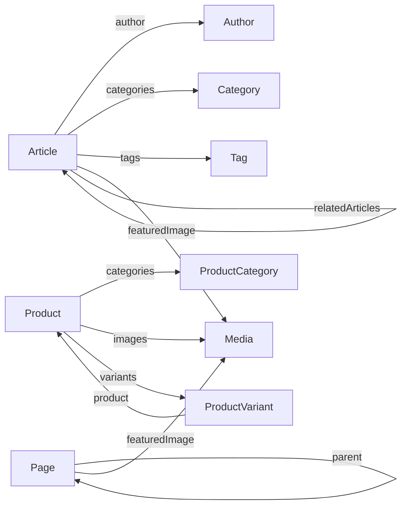

# Map Relationships Command

Generate a visual representation of content type relationships.

## Usage

```bash
/cms:map-relationships --output mermaid
/cms:map-relationships --output ascii --scope type:Article
/cms:map-relationships --output yaml
```

## Output Formats

- **mermaid**: Mermaid diagram syntax
- **ascii**: Text-based diagram
- **yaml**: Structured relationship data

## Workflow

### Step 1: Parse Arguments

Extract output format and scope from command.

### Step 2: Analyze Content Types

Read existing content type definitions from:

- Skill knowledge (if designing)
- Codebase (if implemented)

### Step 3: Invoke Skill

Invoke `content-relationships` skill to analyze:

- Direct references (ContentPickerField)
- Taxonomy associations
- Media references
- Self-referential relationships

### Step 4: Generate Output

**Mermaid Output:**



**ASCII Output:**

```text
CONTENT RELATIONSHIP MAP
========================

Article
├── author ──────────> Author (1:1)
├── categories ──────> Category (1:N)
├── tags ────────────> Tag (1:N)
├── featuredImage ───> Media (1:1)
└── relatedArticles ─> Article (N:N, self)

Product
├── categories ──────> ProductCategory (1:N)
├── images ──────────> Media (1:N)
└── variants ────────> ProductVariant (1:N)

ProductVariant
└── product ─────────> Product (N:1, inverse)

Page
├── parent ──────────> Page (N:1, self)
└── featuredImage ───> Media (1:1)
```

**YAML Output:**

```yaml
relationships:
  Article:
    - field: author
      target: Author
      cardinality: one-to-one
      required: true

    - field: categories
      target: Category
      cardinality: one-to-many
      required: true

    - field: relatedArticles
      target: Article
      cardinality: many-to-many
      self_referential: true

  Product:
    - field: variants
      target: ProductVariant
      cardinality: one-to-many
      inverse: product
```

### Step 5: Identify Issues

Flag potential problems:

- Circular dependencies
- Orphan content types
- Missing inverse relationships
- Over-coupled types

## Related Skills

- `content-relationships` - Relationship patterns
- `content-type-modeling` - Content type structure
