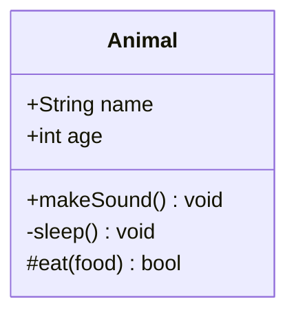
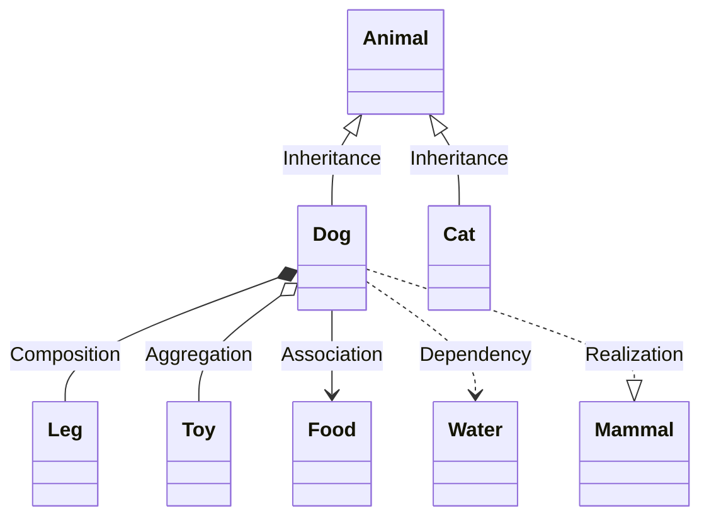
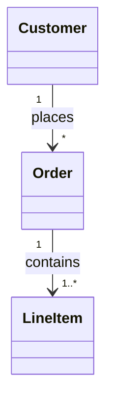
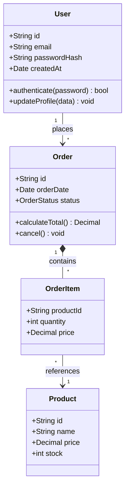

# Class Diagram Syntax

Class diagrams show object-oriented structures and relationships.

## Basic Class Definition

## Visibility Modifiers

| Symbol | Meaning |
| --- | --- |
| `+` | Public |
| `-` | Private |
| `#` | Protected |
| `~` | Package/Internal |

## Relationships

| Syntax | Relationship |
| --- | --- |
| `<\|--` | Inheritance |
| `*--` | Composition |
| `o--` | Aggregation |
| `-->` | Association |
| `..>` | Dependency |
| `..\|>` | Realization |

## Cardinality

## Complete Example

