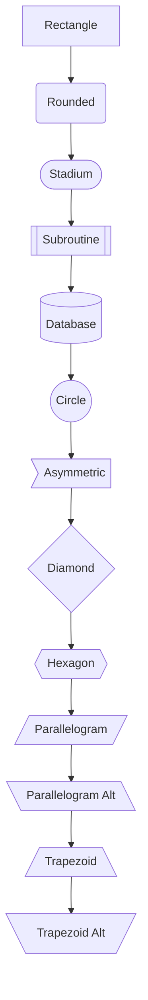
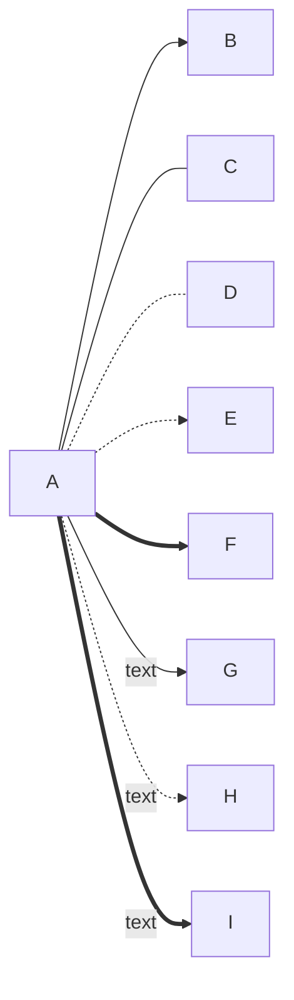
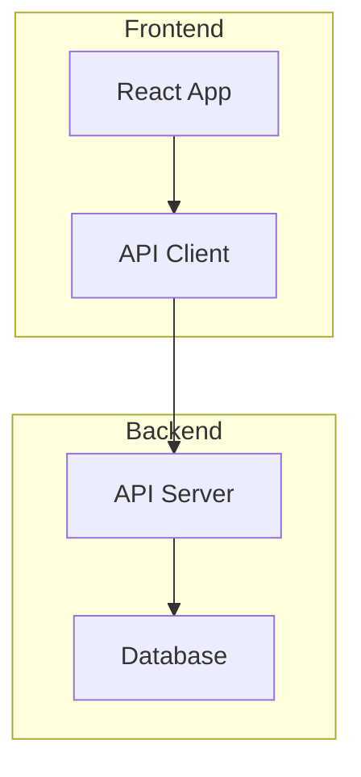
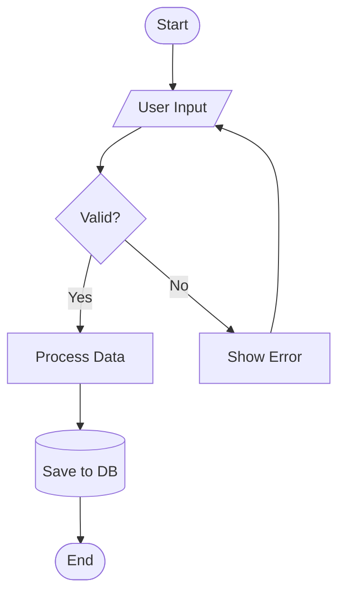

# Flowchart Syntax

Flowcharts visualize processes, decisions, and workflows.

## Direction Keywords

| Keyword | Direction |
| --- | --- |
| `TB` or `TD` | Top to Bottom |
| `BT` | Bottom to Top |
| `LR` | Left to Right |
| `RL` | Right to Left |

## Node Shapes

## Edge/Arrow Types

| Syntax | Description |
| --- | --- |
| `-->` | Arrow |
| `---` | Line (no arrow) |
| `-.-` | Dotted line |
| `-.->` | Dotted arrow |
| `==>` | Thick arrow |
| `--text-->` | Arrow with label |

## Subgraphs

## Complete Example

