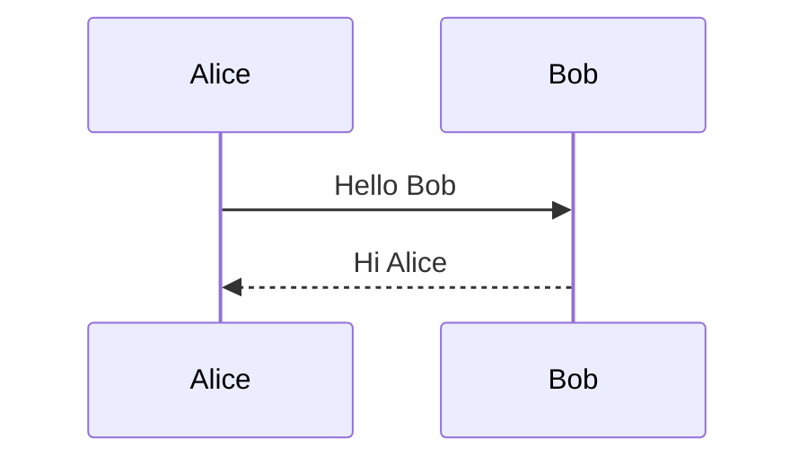
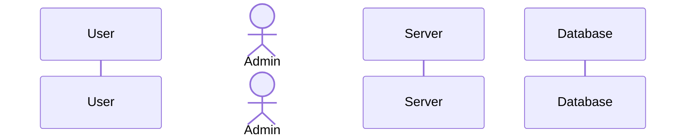
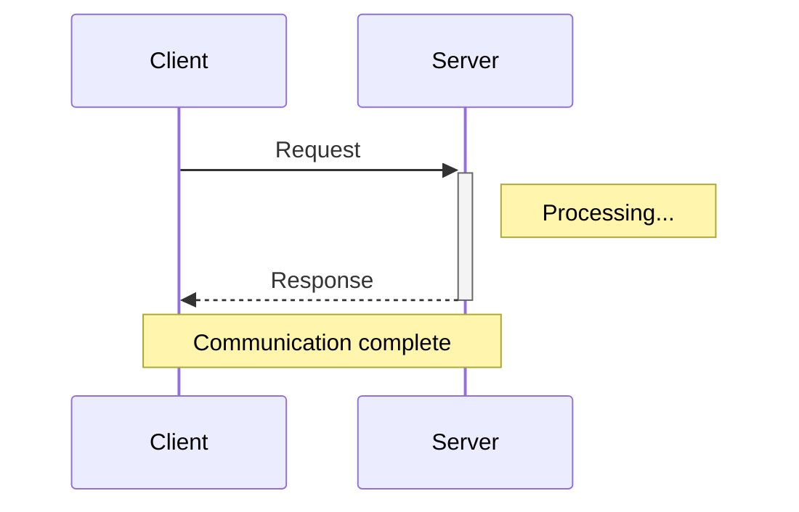
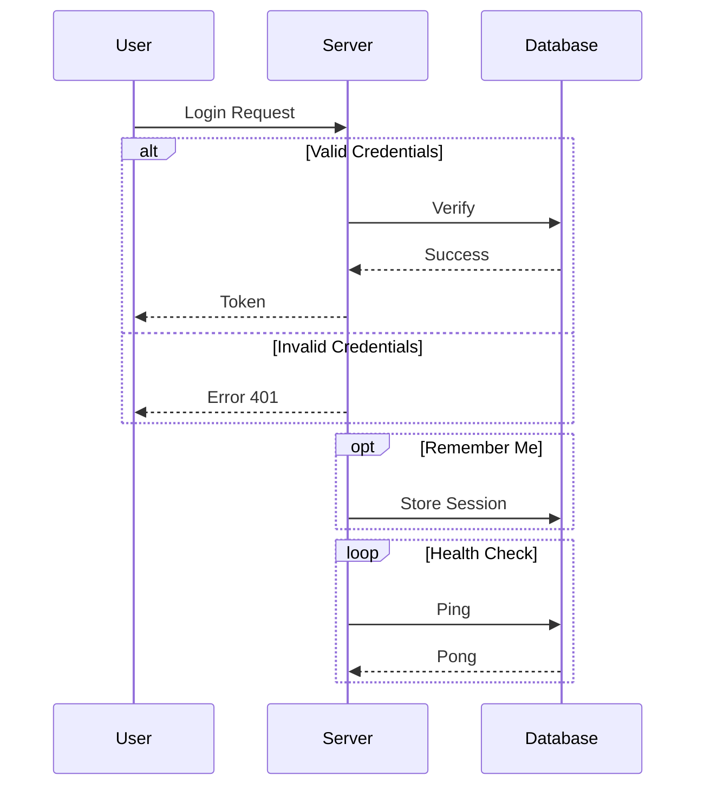
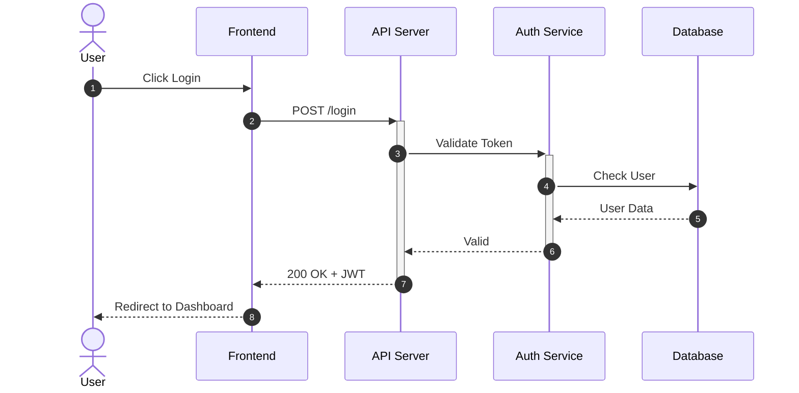

# Sequence Diagram Syntax

Sequence diagrams show interactions between participants over time.

## Basic Syntax

## Arrow Types

| Syntax | Description |
| --- | --- |
| `->` | Solid line without arrow |
| `-->` | Dotted line without arrow |
| `->>` | Solid line with arrow |
| `-->>` | Dotted line with arrow |
| `-x` | Solid line with cross |
| `--x` | Dotted line with cross |
| `-)` | Solid line with open arrow (async) |
| `--)` | Dotted line with open arrow (async) |

## Participant Types

## Activation and Notes

## Loops, Alternatives, and Optionals

## Complete Example

