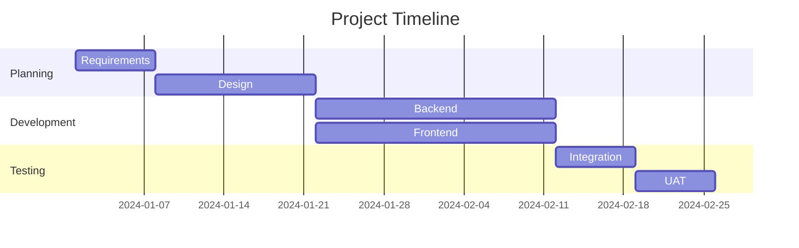
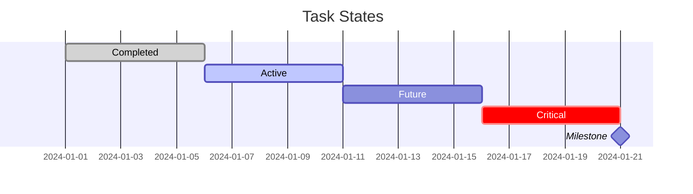
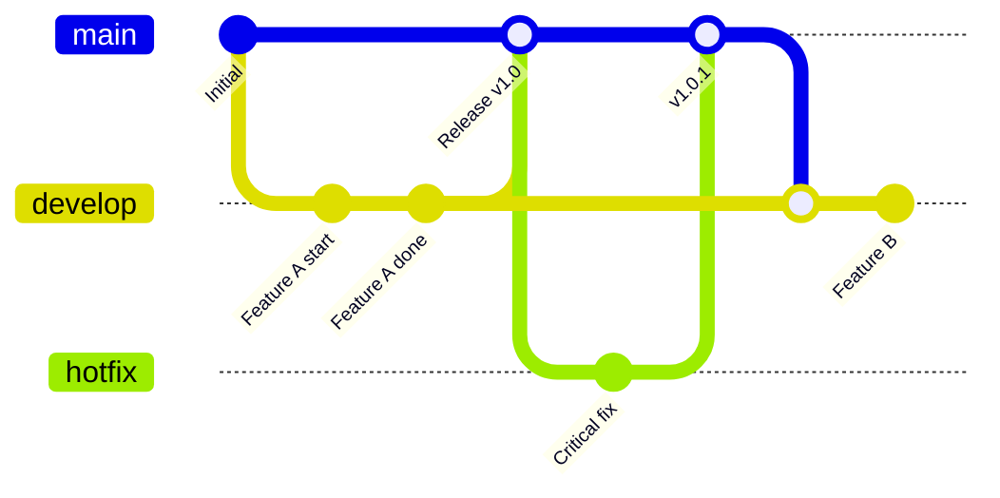
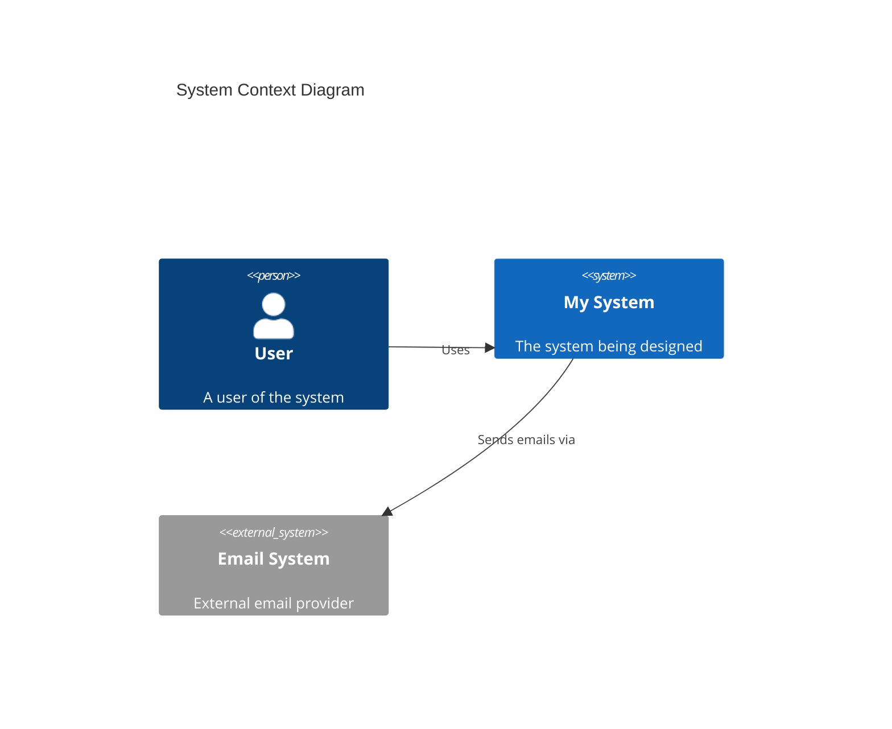
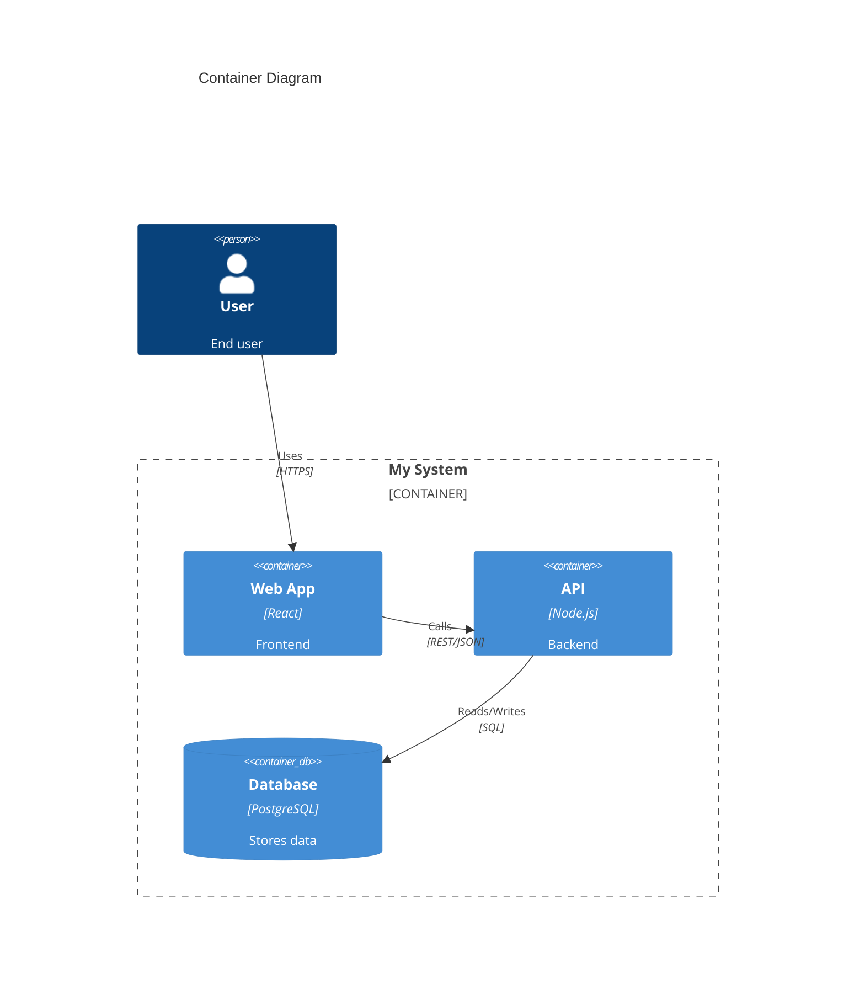
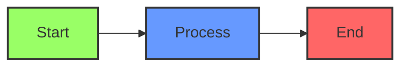
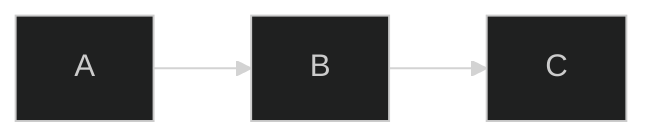

# Special Diagram Types

## Gantt Chart Syntax

Gantt charts show project timelines and dependencies.

### Basic Syntax



### Task States



---

## Git Graph Syntax

Git graphs visualize branching and merge strategies.



---

## C4 Diagram Syntax (Experimental)

C4 diagrams show software architecture at different levels.

**Note:** C4 support in Mermaid is experimental and has rendering limitations. For production C4 diagrams, consider PlantUML.

### C4 Context



### C4 Container



---

## Styling and Theming

### Inline Styling



### Theme Configuration



Available themes: `default`, `dark`, `forest`, `neutral`, `base`

---

## Common Gotchas

1. **Special characters in labels**: Use quotes for labels with special characters

   ```mermaid
   flowchart LR
       A["Label with (parentheses)"]
   ```

2. **Subgraph direction**: Subgraphs inherit parent direction unless specified

   ```mermaid
   flowchart TB
       subgraph sub [Left to Right]
           direction LR
           A --> B
       end
   ```

3. **Node ID restrictions**: IDs cannot start with numbers or contain certain characters
   - Valid: `nodeA`, `node_1`, `myNode`
   - Invalid: `1node`, `my-node` (use `my_node` instead)

4. **Line breaks in labels**: Use `<br/>` for line breaks

   ```mermaid
   flowchart TD
       A["Line 1<br/>Line 2"]
   ```
