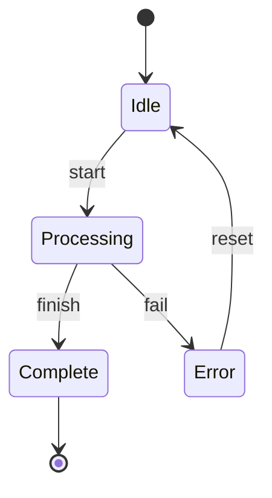
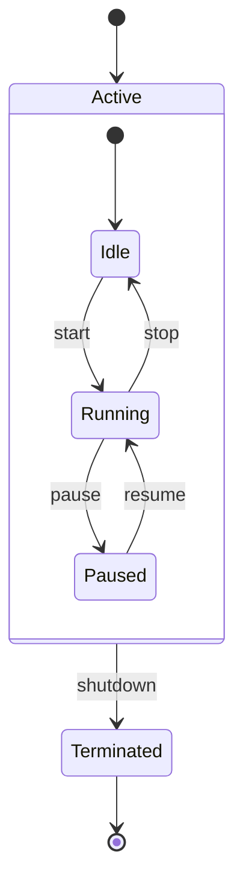
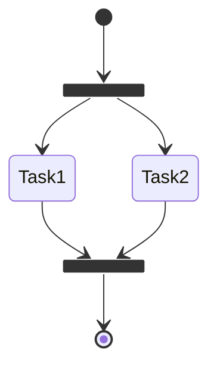
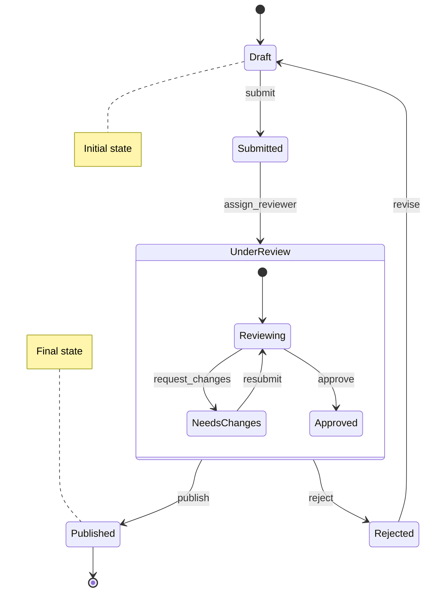
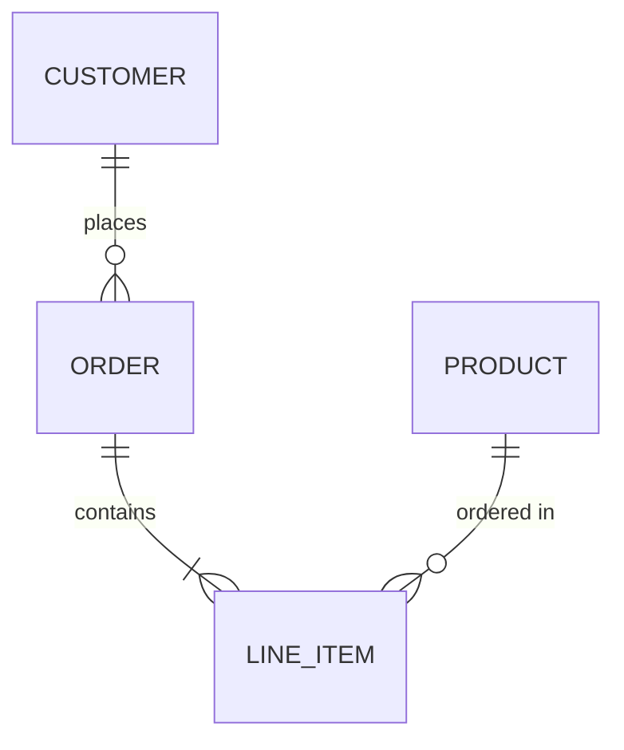
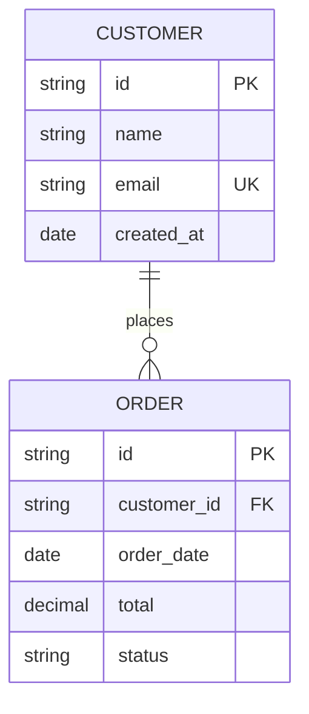
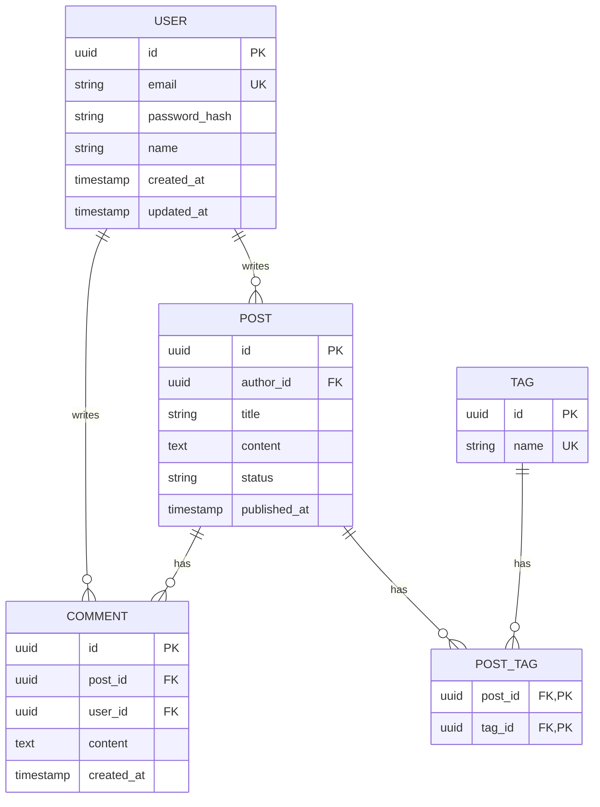

# State and ER Diagram Syntax

## State Diagram Syntax

State diagrams show state machines and transitions.

### Basic Syntax

### Composite States

### Fork and Join

### Complete Example

---

## Entity Relationship Diagram Syntax

ER diagrams show database schemas and relationships.

### Basic Syntax

### Relationship Types

| Syntax | Meaning |
| --- | --- |
| `\|\|` | Exactly one |
| `o\|` | Zero or one |
| `}o` | Zero or more |
| `}\|` | One or more |

### Full Relationship Notation

| Syntax | Meaning |
| --- | --- |
| `\|\|--\|\|` | One to one |
| `\|\|--o{` | One to many |
| `o\|--o{` | Zero-or-one to many |
| `}\|--}\|` | Many to many |

### Entity Attributes

### Complete Example

