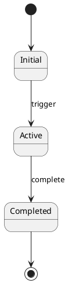
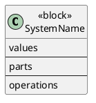

# /specify Command

Create formal specifications for system components, behaviors, and algorithms.

## Usage

```text
/specify "distributed lock protocol"
/specify "order lifecycle" format=state-machine
/specify "vehicle control system" format=sysml
/specify "consensus algorithm" format=tla+
```

## Workflow

### Step 1: Analyze Topic

Parse the specification topic and determine:

- What is being specified (protocol, lifecycle, system, algorithm)
- Key properties to capture (safety, liveness, structure)
- Appropriate formalism to use

### Step 2: Select Specification Format

If format not specified, auto-detect based on topic:

| Topic Pattern | Recommended Format |
|--------------|-------------------|
| "protocol", "consensus", "distributed" | TLA+ |
| "lifecycle", "status", "workflow" | State Machine |
| "system", "hardware", "embedded" | SysML |
| "interaction", "flow", "sequence" | UML |

### Step 3: Invoke Appropriate Skill

Load the relevant skill:

- `tla-specification` for TLA+ specs
- `state-machine-design` for state machines
- `sysml-modeling` for SysML models
- `uml-modeling` for UML diagrams

### Step 4: Gather Requirements

If working in a project with specifications:

- Search for related requirements in `docs/requirements/`
- Check for existing domain models
- Look for related ADRs

### Step 5: Generate Specification

Create the formal specification including:

- Core specification (TLA+ module, SysML diagram, state machine)
- Documentation and comments
- Verification approach (if applicable)
- Implementation guidance

### Step 6: Output Result

Deliver:

1. Specification in chosen format
2. Diagram visualization (PlantUML/Mermaid)
3. Key properties documented
4. Usage notes

## Format-Specific Output

### TLA+

```tla
--------------------------- MODULE TopicName ---------------------------
EXTENDS Integers, Sequences
CONSTANTS ...
VARIABLES ...
Init == ...
Next == ...
Spec == Init /\ [][Next]_vars
Safety == ...
Liveness == ...
=============================================================================
```

### State Machine



### SysML



## Examples

### Distributed Lock

```text
/specify "distributed lock with leader election" format=tla+
```

Output: TLA+ module with mutual exclusion safety property and eventual grant liveness property.

### Order Lifecycle

```text
/specify "e-commerce order lifecycle"
```

Output: State machine diagram showing Draft → Submitted → Paid → Shipped → Delivered states with transitions and guards.

### Vehicle System

```text
/specify "autonomous vehicle perception system" format=sysml
```

Output: SysML BDD showing sensors, processors, and data flows with parametric constraints.

## Integration

The command integrates with:

- **enterprise-architecture**: Links to ADRs
- **requirements-elicitation**: Traces to requirements
- **systems-design**: Aligns with architecture
