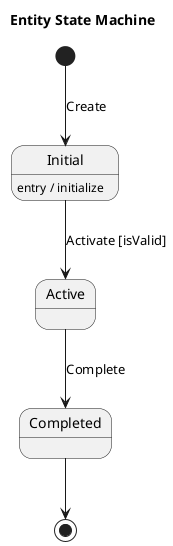
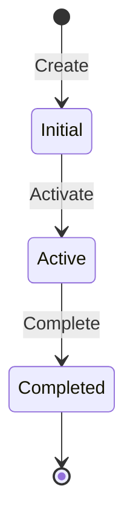

# /state-diagram Command

Create state machine diagrams from behavior descriptions with optional implementation code.

## Usage

```text
/state-diagram "order lifecycle from creation to delivery"
/state-diagram "user account states" format=mermaid
/state-diagram "payment processing workflow" implementation=csharp
/state-diagram "document approval process" format=xstate implementation=typescript
```

## Workflow

### Step 1: Analyze Behavior Description

Parse the description to identify:

- Entity being modeled (order, user, document)
- Lifecycle stages or conditions
- Triggers that cause state changes
- Business rules and constraints

### Step 2: Invoke State Machine Skill

Load the `state-machine-design` skill for:

- State machine patterns and best practices
- Notation syntax for chosen format
- Implementation patterns

### Step 3: Identify States

Extract states from the description:

- Initial state (starting point)
- Normal states (intermediate conditions)
- Final states (terminal states)
- Composite states (if nested behavior)

### Step 4: Define Transitions

Map state changes:

- Events/triggers that cause transitions
- Guards (conditions that must be true)
- Actions (side effects on transition)
- Entry/exit actions for states

### Step 5: Generate Diagram

Create the state machine diagram in chosen format:

- PlantUML for detailed documentation
- Mermaid for inline markdown
- XState for executable TypeScript

### Step 6: Generate Implementation (Optional)

If implementation requested:

- C# with Stateless library pattern
- TypeScript with XState machine
- Transition table approach

### Step 7: Output Result

Deliver:

1. State machine diagram
2. State/event/transition table
3. Implementation code (if requested)
4. Usage notes and edge cases

## Format-Specific Output

### PlantUML



### Mermaid



### XState (TypeScript)

```typescript
import { createMachine } from 'xstate';

const machine = createMachine({
  id: 'entity',
  initial: 'initial',
  states: {
    initial: {
      on: { ACTIVATE: 'active' }
    },
    active: {
      on: { COMPLETE: 'completed' }
    },
    completed: {
      type: 'final'
    }
  }
});
```

## Examples

### Order Lifecycle

```text
/state-diagram "e-commerce order from draft to delivered or cancelled" implementation=csharp
```

Output:

- PlantUML diagram with all order states
- C# implementation using Stateless library
- Transition table with guards

### Document Approval

```text
/state-diagram "document approval with review, revision, and approval stages" format=mermaid
```

Output:

- Mermaid state diagram
- States: Draft, Submitted, UnderReview, NeedsRevision, Approved, Rejected
- Parallel review tracks if applicable

### User Account

```text
/state-diagram "user account lifecycle including verification and suspension" format=xstate implementation=typescript
```

Output:

- XState machine definition
- States: Unverified, Active, Suspended, Deactivated
- Guards for state transitions
- Actions for notifications

## State Machine Elements

### States

| Type | Description |
|------|-------------|
| Initial | Starting point (filled circle) |
| Normal | Regular state |
| Final | End point (circled dot) |
| Composite | Contains sub-states |
| History | Remembers last sub-state |

### Transitions

| Element | Description |
|---------|-------------|
| Event | Trigger for transition |
| Guard | Condition `[isValid]` |
| Action | Side effect `/ notify` |

## Integration

The command integrates with:

- **uml-modeling**: UML state diagrams
- **openapi-design**: API state documentation
- **requirements-elicitation**: Behavior requirements
- **test-strategy**: State transition tests
