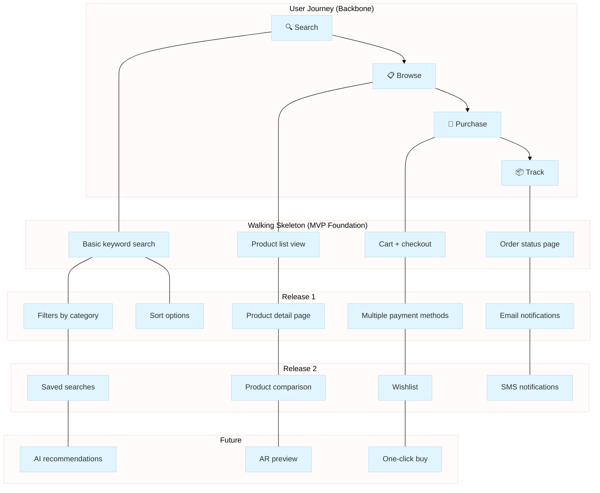

# Story Map Command

Create user story maps from elicited requirements using Jeff Patton's methodology.

## Usage

```bash
/requirements-elicitation:story-map
/requirements-elicitation:story-map --domain "e-commerce"
/requirements-elicitation:story-map --domain "checkout" --releases 3
/requirements-elicitation:story-map --domain "user-auth" --format mermaid
```

## Arguments

| Argument | Required | Description |
|----------|----------|-------------|
| --domain | No | Domain to map (default: current/most recent) |
| --releases | No | Number of release slices to create (default: 3) |
| --format | No | Output format: `mermaid`, `yaml`, `markdown` (default: `mermaid`) |

## Workflow

### Step 1: Load Synthesized Requirements

Read from `.requirements/{domain}/synthesis/` folder to get the consolidated requirements.

### Step 2: Identify Backbone Activities

Analyze requirements to extract high-level user activities:

```yaml
backbone_extraction:
  approach:
    - Group related requirements by user goal
    - Identify the major "things users do"
    - Order left-to-right by typical sequence
    - Aim for 5-10 backbone activities

  questions:
    - "What does the user do first?"
    - "What activities are essential to complete the journey?"
    - "What is the natural sequence?"
```

### Step 3: Define Walking Skeleton

For each backbone activity, identify the minimum viable implementation:

```yaml
walking_skeleton_criteria:
  - "What's the simplest way to accomplish this activity?"
  - "Can a user complete their goal with just this?"
  - "Is this end-to-end through the system?"
  - "Can we deploy and test this?"
```

### Step 4: Map Requirements to Activities

Place each requirement under the appropriate backbone activity:

```yaml
mapping_rules:
  - Match requirement to the activity it enables
  - Order vertically by priority (highest at top)
  - Flag requirements that span multiple activities
  - Note dependencies between requirements
```

### Step 5: Create Release Slices

Draw horizontal lines to group stories into releases:

```yaml
release_slicing:
  mvp:
    - Walking skeleton stories
    - Critical must-haves (from MoSCoW)
    - "What validates the core value proposition?"

  release_1:
    - High-priority enhancements
    - "Should have" requirements
    - "What improves based on MVP feedback?"

  future:
    - Nice-to-have features
    - "Could have" requirements
    - Edge cases and polish
```

### Step 6: Generate Output

Create the story map in the requested format.

## Output Formats

### Mermaid Diagram (Default)



### YAML Export

```yaml
story_map:
  title: "E-commerce Platform"
  domain: "e-commerce"
  created: "2025-12-26"
  source_synthesis: "SYN-20251226-120000.yaml"

  backbone:
    - id: search
      name: "Search Products"
      walking_skeleton: "Basic keyword search"
      emoji: "🔍"

    - id: browse
      name: "Browse Catalog"
      walking_skeleton: "Product list view"
      emoji: "📋"

    - id: purchase
      name: "Purchase"
      walking_skeleton: "Cart + checkout"
      emoji: "🛒"

    - id: track
      name: "Track Order"
      walking_skeleton: "Order status page"
      emoji: "📦"

  releases:
    - name: "MVP"
      value_statement: "Users can find and purchase products online"
      stories:
        - activity: search
          items: ["Basic keyword search"]
        - activity: browse
          items: ["Product list view"]
        - activity: purchase
          items: ["Cart + checkout"]
        - activity: track
          items: ["Order status page"]

    - name: "Release 1"
      value_statement: "Users can find products faster with better options"
      stories:
        - activity: search
          items: ["Filters by category", "Sort options"]
        - activity: browse
          items: ["Product detail page"]
        - activity: purchase
          items: ["Multiple payment methods"]
        - activity: track
          items: ["Email notifications"]

    - name: "Release 2"
      value_statement: "Users can shop more efficiently"
      stories:
        - activity: search
          items: ["Saved searches"]
        - activity: browse
          items: ["Product comparison"]
        - activity: purchase
          items: ["Wishlist"]
        - activity: track
          items: ["SMS notifications"]
```

### Markdown Export

```markdown
# Story Map: E-commerce Platform

## Backbone (User Journey)

| Search | Browse | Purchase | Track |
|--------|--------|----------|-------|
| 🔍 Find products | 📋 Explore catalog | 🛒 Buy items | 📦 Follow orders |

## MVP (Walking Skeleton)

| Search | Browse | Purchase | Track |
|--------|--------|----------|-------|
| Basic keyword search | Product list view | Cart + checkout | Order status page |

## Release 1

| Search | Browse | Purchase | Track |
|--------|--------|----------|-------|
| Filters by category | Product detail page | Multiple payment methods | Email notifications |
| Sort options | | | |

## Release 2

| Search | Browse | Purchase | Track |
|--------|--------|----------|-------|
| Saved searches | Product comparison | Wishlist | SMS notifications |
```

## Example Session

```text
/requirements-elicitation:story-map --domain "inventory-management" --format mermaid

Loading synthesis: .requirements/inventory-management/synthesis/SYN-20251226-143000.yaml
Requirements found: 28

Analyzing user journey...
Identified backbone activities: 5
  1. Monitor Stock
  2. Reorder Items
  3. Receive Shipments
  4. Manage Locations
  5. Generate Reports

Creating walking skeleton...
  - Monitor Stock → "View current stock levels"
  - Reorder Items → "Create purchase order"
  - Receive Shipments → "Mark items received"
  - Manage Locations → "View warehouse list"
  - Generate Reports → "Basic stock report"

Mapping 28 requirements to activities...
  - Monitor Stock: 8 stories
  - Reorder Items: 7 stories
  - Receive Shipments: 5 stories
  - Manage Locations: 4 stories
  - Generate Reports: 4 stories

Creating release slices...
  - MVP: 5 stories (walking skeleton)
  - Release 1: 12 stories
  - Release 2: 8 stories
  - Future: 3 stories

Generating Mermaid diagram...

[Mermaid diagram output]

Saved to: .requirements/inventory-management/story-map/
  - story-map.mmd (Mermaid source)
  - story-map.yaml (Structured data)
```

## Output Locations

```yaml
output_locations:
  mermaid: ".requirements/{domain}/story-map/story-map.mmd"
  yaml: ".requirements/{domain}/story-map/story-map.yaml"
  markdown: ".requirements/{domain}/story-map/story-map.md"
```

## Integration with Other Commands

### After Elicitation

```bash
# Elicit requirements first
/requirements-elicitation:discover "inventory management"

# Then create story map
/requirements-elicitation:story-map --domain "inventory-management"
```

### Before Export

```bash
# Create story map for prioritization
/requirements-elicitation:story-map --domain "checkout"

# Use story map to guide filtered export
/requirements-elicitation:export --domain "checkout" --filter "release:mvp"
```

## Skills Used

This command uses the `user-story-mapping` skill for:

- Backbone identification techniques
- Walking skeleton definition
- Release slicing strategies
- Output formatting guidance

## Error Handling

```yaml
error_handling:
  no_synthesis:
    message: "No synthesized requirements found for domain"
    action: "Run /discover first to elicit requirements"

  insufficient_requirements:
    message: "Too few requirements for meaningful story map (minimum 5)"
    action: "Continue elicitation or combine domains"

  ambiguous_activities:
    message: "Could not determine clear backbone activities"
    action: "Prompt user to clarify main user goals"
```
